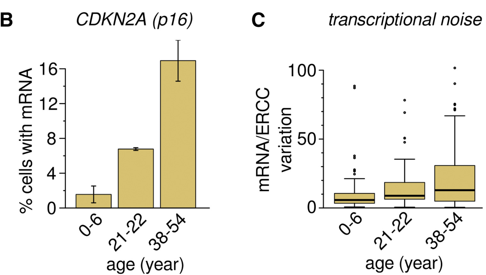

```{r setup, include=FALSE}
knitr::opts_chunk$set(echo = TRUE)
```

\newpage

# I. Introduction


## Overview of the original paper

The human pancreas is a vital organ that performs a crucial role in regulating blood sugar levels and aiding digestion. It produces hormones like insulin and glucagon, which regulate blood sugar levels, and digestive enzymes that help break down food in the small intestine. Dysfunctions in the pancreas can result in severe health issues such as diabetes and pancreatic cancer, which are major global public health concerns (1). Therefore, it is critical to better understand the cellular and molecular mechanisms that govern the function and malfunction of the human pancreas to develop effective diagnostic and therapeutic strategies for pancreatic diseases. To achieve this goal, single-cell analysis of human pancreatic cells is an important tool since it can help identify cell-specific gene expression patterns and somatic mutations that may contribute to pancreatic diseases (2).

However, until a few years ago, studying how cells age has been challenging because we could only examine groups of cells, making it impossible to study individual cells. The study titled "Single-Cell Analysis of Human Pancreas Reveals Transcriptional Signatures of Aging and Somatic Mutation Patterns" is groundbreaking because it analyzed cells of human pancreatic tissue from individuals of various ages, identifying transcriptional signatures of aging and somatic mutation patterns (2). This study is particularly crucial because we had limited knowledge of the number of mutations in post-mitotic cells that cannot divide or grow in a lab. Previous studies on mice brains had already revealed that the rate of mutations in post-mitotic cells may be higher than previously assumed, increasing with age. As the pancreas is an endocrine and exocrine gland linked to age-related diseases such as type II diabetes and pancreatic cancer, it is a great model system to study how cells age and the impact of somatic mutations on gene expression.

In the study, researchers collected pancreas cells from eight previously healthy individuals of different ages and genders, including three juvenile donors (age 0-6), two young adult donors (age 21-22), and three adult/middle-aged donors (38-54). They isolated individual cells from the tissue samples using flow cytometry and performed single-cell RNA sequencing to measure the gene expression profiles of over 2,544 human pancreatic cells. The obtained data were subjected to quality control and dimensionality reduction analysis using tSNE to cluster different cell types into distinct regions. The identified cell types included alpha, beta, delta, mesenchymal, ductal, acinar, and pancreatic polypeptide (PP) cells. The results showed consistent clustering of different cell types across all donors, indicating minimal donor- or sequencing-related batch effects.

## Significance of reproducing the study

Reproducing this study holds significance in multiple ways. To begin, it would validate the original study's findings and generate further evidence for transcriptional signatures of aging and somatic mutation patterns in the human pancreas. The study's reliability could also improve by conducting it with different tools and analysis techniques. Moreover, the reproduction of the study could broaden its scope by exploring other questions that were not addressed initially. While the original study focused on identifying the effects of aging and somatic mutations on gene expression in the pancreas, several other factors, like environmental exposures, lifestyle habits, and genetic predispositions, may influence gene expression patterns in the pancreas. Conducting the study again and examining these factors could provide researchers with a more comprehensive understanding of gene expression patterns in the pancreas.

## Scope of the re-analysis

The re-analysis of the study focuses on replicating the original findings with a reduced sample size due to resource constraints on the shared compute cluster. Out of the 2544 files available, 927 files were randomly selected for analysis.The reduced sample size allowed for quicker computation times and minimized the usage of memory, disk space, and computing threads.

The original paper's method comprised analysing RNA sequencing data from isolated single cells from human pancreas tissues. After that, the RNA sequencing data was examined to find gene expression patterns connected to ageing and somatic mutations in various pancreatic cell types. In the re-analysis, a similar approach is taken, starting with the raw FASTQ files which were processed to obtain raw counts. The raw counts were then preprocessed and visualized to verify that the same findings, such as cell type clusters and transcriptional noise, could be observed.The scope of the re-analysis did not include exploring additional factors, such as environmental exposures or lifestyle habits, that may influence gene expression patterns in the pancreas. In each section of the re-analysis below, the approach taken by the paper is briefly described, followed by steps taken to reproduce or improve the methodology.

# II. Methods and Results

## Obtaining FASTQ Files

The FASTQ files for the original study were made available in the NCBI Sequence Read Archive (SRA) under the accession number SRP075496. The following steps were followed to retrieve the FASTQ files:

1.  The SRA Tools package (sratoolkit.3.0.1-ubuntu64) and Screen package (v4.8.0) were installed
2.  The "prefetch" command was used to download all SRA files using the SRA accession number. The "prefetch" command was used since it allows incomplete run downloads to be corrected or finished at a later time. [<https://www.ncbi.nlm.nih.gov/sra/docs/sradownload/>]
3. The "fasterq-dump" command was used to convert the SRA files to a pair of FASTQ files (paired-end) which were subsequently compressed using gzip. By default, the "fasterq-dump" command works similar to the slower and older "fastq-dump" command with the addition of the "--split-3" flag which separates reads into left and right ends (or into a separate file in the case of missing left or right ends). The combination of the "prefetch" + "fasterq-dump" + "gzip" commands proved to be faster than using the "fastq-dump" command with the --gzip flag. [<https://github.com/ncbi/sra-tools/wiki/HowTo:-fasterq-dump>]
4.  A bash script was created to allow the script to run on multiple background screens and to ensure that the transient SRA folders are deleted as soon as we obtain the gzipped FASTQ files. The script also checks if the conversion to FASTQ commands ran properly before deleting the prefetched SRA folders. The bash script takes a single argument which allows us to process a specific subset of the 2544 SRA folders in each background screen (e.g. the "SRR35635" subset would comprise of accessions SRR3563500-SRR3563599). The bash script is provided below:

```{bash, eval=F}
#!/bin/bash

# Location of the SRA Toolkit
SRATOOLKIT_DIR=sratoolkit.3.0.1-ubuntu64/bin

# Check if an argument is provided
if [ $# -eq 0 ]
  then
    echo "No argument supplied, please provide an SRR* subset variable"
    exit 1
fi

# Looping through each SRA folder, converting to 
# .fastq, and then compressing to .fastq.gz
for sra_folder in "$1"*
do
    # Convert to FASTQ
    $SRATOOLKIT_DIR/fasterq-dump -O fastq_files $sra_folder

    # Compress the FASTQ files
    gzip fastq_files/${sra_folder}_1.fastq
    gzip fastq_files/${sra_folder}_2.fastq

    # Deleting the SRA folder if the compression was successful
    if [ $? -eq 0 ]; then
        echo "Succesfully compressed ${sra_folder}, deleting SRA folder..."
        rm -rf ${sra_folder}
    else
        echo "Compression failed for ${sra_folder}, keeping SRA folder..."
    fi
done
```

## Inspecting the quality of FASTQ files

In the original paper, cutadapt was used to trim adapters and low quality bases. This was followed by alignement of reads to hg19 human genome using BWA-MEM. Picard tools was used to remove duplicates.

In order to determine what quality control steps have already been performed on the obtained FASTQ files (and what needs to be done), the following steps were followed:

1.  The FastQC (v1.6) package was installed and a new folder was made to store the quality control report for all FASTQ files
2.  A sample of 12 reports was imported into a local computer for further analysis.

Upon manual analysis of the HTML reports, it was found that the quality of the FASTQ files were similar and that the trimming of adapters and low quality bases was already performed on the FASTQ files deposited in SRA. Below is a representative example of a FastQC report (- 21yr_male_cell1: SRR3562210_2.fastq.gz):


As it can be seen in the figure above, the data quality is generally high as there are no sequences marked as having poor quality and we can see that the adapters have been trimmed in the adapter content graph.

There are however several areas of concern such as in the sequence length distribution, per sequence GC content, sequence duplication levels, per vase sequence content, and overrepresented sequences. For example, we can see that the per sequence GC content is flagged with a warning since it differs from the theoretical distribution. However we can see that it still generally follows a normal distribution, and the sharp peak could indicate a highly over-expressed gene or contamination. 

Moreover, the fact that each FASTQ pair corresponds to one cell helps to explain some of the areas of concern mentioned. For example, overrepresented sequences can be caused from various sources, such as adapter contamination, PCR amplification bias, or ribosomal RNA depletion inefficiency. Because each FASTQ pair corresponds to one cell, overrepresented sequences can indicate issues with a particular cell's cDNA library.

## Trimming FASTQ files

Although we found that cutadapt was already used to trim adapters and low quality bases, we decided to further improve the FASTQ files' quality. The following steps were then followed:

1.  Trim-galore (v0.6.2) which is a wrapper script for Cutadapt and FastQC was installed
2.  Trim Galore! was used with the following options:
  - --quality 20, to trim any base with a Phred quality score lower than 20
  - --length 20, to discard reads shorter than 20 bases
  - --clip_R1 10 and --clip_R2 10, the first 10 bases of each read was trimmed to remove any adapter contamination or low-quality bases

This improved the per Base sequence content, per sequence GC content, sequence duplication levels and overexpressed sequences

## Genome alignment and obtaining transcript counts

In the original paper, it was mentioned that reads were aligned to hg19 human genome. Therefore we used the same reference genome for our re-analysis. The following steps were followed:

1. The STAR package (v2.7.10b), Picard package (v2.18.7), and Subread package (v2.0.3) were installed
2. A pre-made hg19 genome index and corresponding reference annotation file was downlaoded from the following link: [<https://data.broadinstitute.org/snowman/hg19/star/>] 
3. STAR was used to align our paired-end reads to the hg19 genome and obtain the results in a sorted BAM format
4. Picard was used to remove duplicate reads from the alignment results.
5. Featurecounts from the Subread package was used to assign reads to features based on their genomic location to generate raw count tables using our reference annotation file.
6. The gene and counts columns (1 and 7) were then extracted from each count text file and compressed using gzip.

It is important to note that the "loading genome" step of the alignment takes about 3 minutes per FASTQ pair (over 5 days for all 2544 pairs) due to the detailed genome we used. The aligning step itself was relatively quick, taking around 10-30 seconds. In order to save time, we attempted to use the --genomeLoad LoadAndKeep option to load the genome as a standard Linux shared memory, however this was not feasible since our system did not allow large enough shared memory blocks.[https://physiology.med.cornell.edu/faculty/skrabanek/lab/angsd/lecture_notes/STARmanual.pdf] We would have needed to increase the allowed shared memory blocks to around 30GB using root privileges, which was not possible due to the scope of this project and to avoid hogging computing resources which would be necessary for other teams. Therefore we resorted to performing our analysis on a smaller subset of the data. In order to achieve this, the list of FASTQ file names was shuffled and 927 out of the 2544 FASTQ pairs (about one third) were processed further.

The bash script to perform the mentioned steps is included below:

```{bash, eval=F}
#!/bin/bash

# Setting the directory containing the FASTQ files
FASTQ_DIR="fastq_files"

# Setting the directory for the output sorted BAM files
BAM_DIR="bamFiles"

# Setting the directory for the deduplicated BAM files
DEDUP_DIR="noDups"

# Setting the directory for the raw count output files
COUNT_DIR="rawCounts"

# Setting the path to the GTF annotation file
GTF_FILE="aligningSTAR/gencode.v19.annotation.gtf"

# Setting the path to the STAR genome index
GENOME_DIR="aligningSTAR/STAR2.7.10a_genome_hg19_noALT_noHLA_noDecoy_v19_oh145"

# Setting the number of threads to use
THREADS=8

# Getting a list of all the FASTQ file pairs in the directory
PAIR_LIST=("$FASTQ_DIR"/*_1.fastq.gz)

# Shuffling the list of file pairs and keeping the first 927 entries
shuf -e "${PAIR_LIST[@]}" -o pair_list_shuffled.txt
head -n 927 pair_list_shuffled.txt > pair_list_shuffled_first_927.txt

# Looping over the shuffled list of FASTQ file pairs
while read -r PAIR; do
  # Extracting the file name prefix (e.g. SRR3562210) from the file path
  PREFIX=$(basename "${PAIR%_1.fastq.gz}")

  # Running the STAR command for this pair of files
  STAR --runThreadN "$THREADS" \
       --readFilesCommand zcat \
       --genomeDir "$GENOME_DIR" \
       --readFilesIn "$PAIR" "${PAIR%_1.fastq.gz}_2.fastq.gz" \
       --outFileNamePrefix "$BAM_DIR/$PREFIX" \
       --outSAMtype BAM SortedByCoordinate
       
  # Getting the BAM file path for the current prefix
  BAM="$BAM_DIR/${PREFIX}Aligned.sortedByCoord.out.bam"

  # Marking duplicates and writing deduplicated BAM file
  picard MarkDuplicates \
      INPUT="$BAM" \
      OUTPUT="$DEDUP_DIR/$PREFIX"_dedup.bam \
      METRICS_FILE="$DEDUP_DIR/$PREFIX"_metrics.txt

  # Generating raw counts using featureCounts
  featureCounts -T 8 -p -t exon -g gene_name -a "$GTF_FILE" \
      "$DEDUP_DIR/$PREFIX"_dedup.bam -o "$COUNT_DIR/$PREFIX".txt

  # Extracting the first and seventh columns of the raw counts output file
  awk '{print $1, $7}' "$COUNTS_DIR/$PREFIX".txt > "$COUNTS_DIR/$PREFIX"_counts.txt
  gzip "$COUNTS_DIR/$PREFIX"_counts.txt
  
  # Removing intermediate files
  rm "$BAM_DIR/$PREFIX.bam"
  rm "$DEDUP_DIR/$PREFIX.bam"
done < "$PAIR_LIST"

```

## Pre-processing & visualization of cell clusters

In the original paper, it was mentioned that the raw transcript counts were first normalized into log transformed counts per million. Next, the cells with less than 100 total counts and those with low actin CPM were removed. A t-sne plot including marker-gene-derived cell identity was created to visialize the pre-processed dataset, and is included below.


In order to reproduce the same visualization, the raw data was imported into a local computer. The R programming language was used for the next steps. The code including descriptive comments are included below:

```{r,message=FALSE, warning=FALSE, results=FALSE, error=FALSE}
# loading required packages
library(Seurat)
library(gridExtra)
library(ggplot2)
```

```{r,message=FALSE, warning=FALSE, results=FALSE, error=FALSE,eval=T}
pathFolder = "finalCompressed"

# Creating an empty data frame for storing all counts
gene_counts <- data.frame()

# Looping through all compressed raw count files in the folder
for (file in list.files(pathFolder, 
                        pattern = ".txt.gz", full.names = TRUE)) {
  
  # Reading the file and adding the counts to the data frame
  counts <- read.table(gzfile(file), header = T, sep = "", 
                       col.names = c("gene_name", "count"))
  gene_counts[counts$gene_name, 
              substr(basename(file), 1, 10)] <- counts$count
}

gene_counts <- as.data.frame(gene_counts)

# Normalizing counts per million (CPM)
# using the same formula mentioned in the original paper
cpm <- apply(gene_counts, 2, function(x) {
  log2(x * 1000000 / sum(x) + 1)
})

# finding high quality cells based on total valid counts 
# The Since only the cells that were deemed of high quality 
# were provided in the SRA, no cells were deemed of low quality.
keep <- apply(cpm, 2, function(x) {
  sum(x) > 100
})
```

```{r,message=FALSE, warning=FALSE, results=FALSE, error=FALSE,eval=T}
# Creating a Seurat object from the normalized counts
seurat_obj <- CreateSeuratObject(counts = cpm)

# Although the 500 most highly expressed genes were selected in
# the paper, here we select the 500 most variable genes
seurat_obj <- FindVariableFeatures(
  seurat_obj,selection.method = "vst", nfeatures = 500)

# Scaling data and performing PCA in order to reduce dimensionality
seurat_obj <- ScaleData(seurat_obj)
seurat_obj <- RunPCA(seurat_obj)

# Finding clusters
 seurat_obj <- FindNeighbors(seurat_obj, dims = 1:50)
 seurat_obj <- FindClusters(seurat_obj, resolution = 5)

# Running t-SNE and UMAP
seurat_obj <- RunUMAP(seurat_obj, dims = 1:50)
seurat_obj <- RunTSNE(seurat_obj,)

# Creating a list of plots
plot_list1 <- list(
  DimPlot(seurat_obj, reduction = "tsne", pt.size = 0.2, 
          label = F, label.size = 1) + NoLegend(),
DimPlot(seurat_obj, reduction = "umap", pt.size = 0.2, 
        label = F, label.size = 1) + NoLegend()
)
grid.arrange(grobs = plot_list1, ncol = 2)
```

Although we have only used about a third of the cells than those used in the original study, we can see from the figures above that we are able to visualize clear and distinct clusters in both UMAP and t-SNE visualizations. This validates the robustness and reproducibility of the original t-SNE projection. This also suggests that even with a smaller number of samples it is still possible to get biologically meaningful results that could help us better understand the underlying cellular heterogeneity of the dataset.

In the visualization, each point represents a cell, and its color corresponds to the cluster it belongs to. These clusters are formed based on the similarities between cells that are in close proximity to one another, with each cell assigned to a random cluster based on these similarities.

In order to confirm the biological significance of the clusters, it is important to examine the marker genes that were used in the original study. These marker genes are known to be expressed in specific cell types and can provide us insight into the identity and function of the pancreas cells within each cluster. By analyzing the expression of these markers, we can determine whether the clusters we observe align with known cell types. The marker genes and the corresponding cells they are expressed in are as follows: INS: Beta cells, GCG: Alpha cells, SST: delta cells, 
 PRSS1: acinar cells, PROM1: ductal cells, THY1: mesenchymal cells, PPY: PP cells. The R code to perform this analysis is provided below:

```{r, message=FALSE, warning=FALSE, results=FALSE, error=FALSE, eval=T}
# Using the same marker genes in the original paper. 
features <- c("INS", "GCG", "SST", "PRSS1", "PROM1", "THY1", "PPY")

# Creating a list of plots and looping for each gene
# The UMAP project was used since it shows the most
# closely packed and distinguishable "clusters"
plot_list2 <- lapply(features, function(feat) {
  FeaturePlot(object = seurat_obj, features = feat, reduction = "umap", 
              pt.size = 0.5, cols = c("lightgrey", "red")) + 
    ggtitle(feat) + 
    theme(axis.text = element_blank(), axis.ticks = element_blank(), 
          axis.line = element_blank(), 
          plot.title = element_text(size = 15), 
          axis.title = element_text(size = 5)) + NoLegend()
})

# Creating a table of plots
grid.arrange(grobs = plot_list2, ncol = 4)
```

The plots above show the UMAP project of the cells, where each point is a cell in the dataset. The color of each point represents the expression level of that cell for the marker gene we are examining. For example, if a cell has higher expression levels of the INS gene, it will be more red and less grey than another cell with a lower expression level.

We can clearly see that the formed clusters correspond at least partially tot he cell type of the cells. For example, when observing the "INS" and "GCG" plots, which aim to identify beta and alpha cells, respectively, we notice that cells that are known to belong to these cell types are clustered together and highlighted in red. Interestingly, these cells are located in distinct regions of the plot, providing evidence for their segregation into separate cell populations.

Moreover, we can also see that the UMAP projection allows for the identification of additional cell populations beyond those previously characterized by the original study. In other words, we can see distinct groups of cells that do not correspond to any of the marker genes provided, suggesting the presence new or subcategories of cell types in the dataset. Further investigation of these populations could be useful in providing insights into new cell functions or potential therapeutic targets.


## Ageing and transcriptional noise 

In order to explore the impact of age on transcriptional noise, the original study divides the samples into three categories: juvenile (0-6 years), young adult (21-22 years), and middle-aged (38-54 years) donors. The researchers begin by examining the proportion of cells expressing the CDKN2A gene, which is linked to the ageing process. Next, they evaluate transcriptional noise in beta cells by analyzing whole-transcriptome cell-to-cell variability. The two corresponding visualizations are provided below:



By examining figure B, we notice that with age, the percentage of cells expressing CDKN2A increases. The box plots in figure C show that there is more cell-to-cell transcriptome variability associated with higher age. These findings are also consistent with previous research on ageing, which has shown that higher age is associated with an increased cellular heterogeneity across various tissues and cell types.

Reproducing these two figures is important since they highlight the main findings from the original study and provide valuable insights into the ageing process at the single-cell transcriptomic level. The code used to reproduce the figures is included below:

```{r,eval=T}
# Finding the fraction of cells expressing CDKN2A

# Manually imported metadata from SRA since no 
# metadata or labeling file was available 
metaData = read.table("metaData.txt",sep = "\t", header = T)
rownames(metaData) = metaData$Run
age_label = data.frame(metaData[colnames(seurat_obj),]$DONOR_AGE)
colnames(age_label) <- c("age")
seurat_obj@meta.data <- cbind(seurat_obj@meta.data, age_label)

# Extracting CDKN2A expression data for each cell
cdkn2a_expression = seurat_obj@assays$RNA@data["CDKN2A", ]

# Defining the age categories
age_categories <- c("0-6", "21-22", "38-54")
age_category_labels = cut(age_label$age, 
                                 breaks = c(0, 6, 22, 54), 
                                 labels = age_categories)

# Calculating fraction of cells expressing CDKN2A (p16) in each age group
cdkn2a_mean_by_age <- aggregate(cbind(CDKN2A = cdkn2a_expression), 
                                by = list(age = age_category_labels), 
                                FUN = function(x) mean(x > 0)*100)
```

```{r,eval=T}
# Finding Beta Cell Transcriptional Noise and plotting

# Extracting beta cell data and label cells with age categories
celltype_label = data.frame(
  metaData[colnames(seurat_obj),]$inferred_cell_type)
colnames(celltype_label) <- c("celltype")
seurat_obj@meta.data <- cbind(seurat_obj@meta.data, celltype_label)
beta_cells <- subset(seurat_obj, subset = celltype == "beta")
gene_expr_df_beta <- as.data.frame(
  as.matrix(beta_cells@assays$RNA@data)["GCG",])
gene_expr_df_beta$age <- beta_cells@meta.data$age
colnames(gene_expr_df_beta) = c("GCG", "age")

#Defining age categories for beta cells
age_categories <- c("0-6", "21-22", "38-54")
category_labels_beta = cut(gene_expr_df_beta$age, 
                                 breaks = c(0, 6, 22, 54), 
                                 labels = age_categories)

# Calculating coefficient of variation (CV) for each gene
col_sd <- apply(as.matrix(beta_cells@assays$RNA@data), 2, sd)
col_mean = colMeans(as.matrix(beta_cells@assays$RNA@data))
variation = as.data.frame(col_sd/col_mean)

# Creating a list of plots
plot_list3 <- list(ggplot(cdkn2a_mean_by_age, aes(x = age, y = CDKN2A)) +
  geom_bar(stat = "identity", fill = "gold", color = "black") +
  xlab("Age group (year)") +
  ylab("Fraction of cells (%)")+
  ggtitle("CDKN2A (p16)"),
ggplot(variation, aes(x = factor(category_labels_beta), 
                      y = col_sd/col_mean)) +
  geom_boxplot(fill = "gold") +
  labs(x = "Age group (year)", y = "Coefficient of Variation (CV)") +
  ggtitle("Beta Cell Transcriptional Noise")
)
grid.arrange(grobs = plot_list3, ncol = 2)
```


As it can be seen from the figures titled "CDKN2A (p16)" and "Beta Cell Transcriptional Noise" above, we were able to confirm the findings in the original paper paper regarding increased transcriptional heterogeneity with ageing. The illustrations are not completely identical since our sample size is one third of the sample size in the original study. Moreover the exact same  analysis technique was not employed when calculating transcriptional noise. This is because the method of obtaining mRNA/ERCC variation as a measure of transciptional noise was not described in the original paper. In this re-analysis, a coefficient of variation consisting of standard deviation of all transcript counts divided by the mean transcript count per cell was used. Nevertheless, very similar results were obtained, which indicates that our analysis is robust and provides additional support for the conclusions drawn in the original study.


## Ageing and transcriptional noise 

The original paper then explores cell-atypical hormone excretion. In figure E below, the researchers visualize the atypical glucagon (GCG) transcripts in beta cells and insulin (INS) transcripts in alpha cells (although GCG is a marker for alpha cells, and INS is a marker for beta cells). They found that a subset of beta and alpha cells simultaneously expressed both GCG and INS and that fraction of cells showed higher expression of both insulin and glucagon with increasing age. This is intriguing since in spite of increased hormone secretion in the aging pancreas, there is transcriptional instability, caused by atypical gene expression. 


In order to verify that we observe the same phenomena in our dataset, we reproduced the findings. The R code is included below: 

```{r,eval=T}
#Finding atypical gene expression

# Subsetting the Seurat object to only include alpha cells
# Beta cells are already subsetted in the code above
alpha_cells <- subset(seurat_obj, subset = celltype == "alpha")

# Extracting gene expression data for INS gene and create a data frame
gene_expr_df_alpha <- 
  as.data.frame(as.matrix(alpha_cells@assays$RNA@data)["INS",])
gene_expr_df_alpha$age <- alpha_cells@meta.data$age
colnames(gene_expr_df_alpha) = c("INS", "age")

#Defining age categories for alpha cells
category_labels_alpha = cut(gene_expr_df_alpha$age, 
                                 breaks = c(0, 6, 22, 54), 
                                 labels = age_categories)

# Creating a new column with age categories 
# based on the values in the age column
gene_expr_df_beta$age_category <- category_labels_beta
gene_expr_df_alpha$age_category <- category_labels_alpha

# Creating a list of plots
plot_list4 <- list(ggplot(cdkn2a_mean_by_age, aes(x = age, y = CDKN2A)) +
  ggplot(gene_expr_df_beta, aes(x = factor(age_category), y = GCG)) +
  geom_boxplot(fill = "red") +
  labs(x = "Age group (year)", y = "log2 CPM") +
  ggtitle("GCG mRNA in beta cells"),
ggplot(gene_expr_df_alpha, aes(x = factor(age_category), y = INS)) +
  geom_boxplot(fill = "blue") +
  labs(x = "Age group (year)", y = "log2 CPM") +
  ggtitle("INS mRNA in alpha cells")
)
grid.arrange(grobs = plot_list4, ncol = 2)

```

Although we used only one third of the dataset used in the original study, we were able to reproduce a shockingly similar visualization.This further confirms that the aging pancreas appears to be simultaneously expressing two hormones that are typically associated with separate cell types, which could indicate a loss of cell identity and potentially contribute to the dysfunction of the pancreas in older individuals. This co-expression of GCG and INS in beta cells is particularly surprising, as GCG is a marker for alpha cells, suggesting that we might potentially misidentify of cell in our analysis. This might also explain why the alpha and beta cell clusters in the UMAP were not completely separated, since there might be a subset of cells that are expressing both GCG and INS and therefore overlapping between the two populations.


# III Conclusion

By using the same dataset and analysis techniques as the original paper titled "Single-Cell Analysis of Human Pancreas Reveals Transcriptional Signatures of Aging and Somatic Mutation Patterns", we were able to confirm several key findings regarding the transcriptional signatures of aging in human pancreatic cells. Our analysis also revealed potential limitations and biases in the original study, such as the potential misidentification of cells due to the co-expression of alpha and beta cell markers.

One surprising finding in our re-analysis was the identification of previously unnoticed cluster of cells in our UMAP visualization, which may have been missed in the original study due to the clustering algorithm used. This underlines the importance of exploring multiple analytical methods and algorithm and performing detailed quality control measures to ensure the accuracy and robustness of results in single-cell RNA sequencing studies.

Overall, this re-analysis underscores the value of independent verification of scientific findings and the importance of sharing raw data and analysis techniques for transparent and reproducible research. Further studies using larger sample sizes and more refined analytical techniques are necessary to fully understand the complex transcriptional changes that occur in the aging pancreas, and the potential implications for pancreatic function and disease. 

Specifically, future studies could focus on expanding the sample size or using other datasets (either pancreas or other tissues) to validate the findings. Moreover, more sophisticated techniques to better capture the complexity of the transcriptional changes in aging cells could be used with a diverse multidisciplinary research team.


# IV References


[1] Karpińska M, Czauderna M. Pancreas—its functions, disorders, and physiological impact on the mammals’ organism. Frontiers in Physiology. 2022;13.  

[2] Enge M, Arda HE, Mignardi M, Beausang J, Bottino R, Kim SK, et al. Single-cell analysis of human pancreas reveals transcriptional signatures of aging and somatic mutation patterns. Cell. 2017;171(2).  

